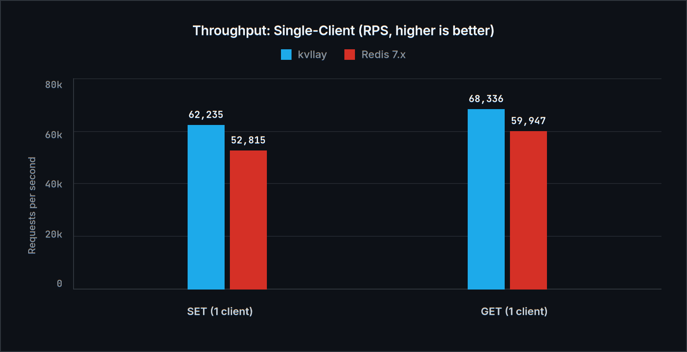
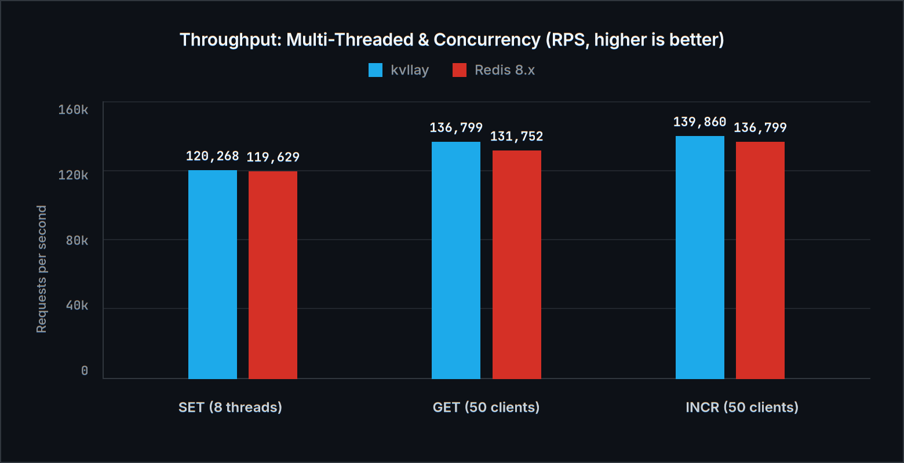

<div align="center">
  
  <h1>kvllay</h1>
  <p><em>[pronounced: <strong>key-vi-lay</strong> · «кей-ви-лей» (key-value allay)]</em></p>
  <p>In-memory key-value store</p>

  <p>
    <a href="https://github.com/keeniGithub/kvllay/releases">Release</a> •
    <a href="docs/ru.md">Русская документация</a> •
    <a href="docs/en.md">English Documentation</a>
  </p>
</div>

Compatible with standard `redis-cli` and official client SDK libraries for any programming language.

## Features
- **RESP2 Protocol**: full support for Redis command formats (arrays, bulk strings, errors, integers, inline commands).
- **Security (AUTH)**: password protection (`--requirepass` / `-a`), safeguards against unauthorized access (`NOAUTH` / `WRONGPASS`).
- **Network Configuration**: bind to any network interface (`0.0.0.0` for network access, `127.0.0.1` for local access only).
- **Commands**:
  - `AUTH [username] password`
  - `PING [message]`
  - `SET key value`
  - `GET key`
  - `DEL key [key ...]`
  - `EXISTS key [key ...]`
  - `KEYS [pattern]`
  - `DBSIZE`
  - `FLUSHDB`
  - `EXPIRE key seconds` / `PEXPIRE key milliseconds`
  - `TTL key` / `PTTL key`
  - `PERSIST key`
  - `SETEX key seconds value`
  - `ECHO message`
  - `COMMAND` / `COMMAND DOCS` (redis-cli handshake)
  - `INFO`
  - `QUIT`
- **Thread Safety**: `std::shared_mutex` (fast concurrent reads with `GET`, synchronized writes with `SET`/`DEL`).
- **TTL & Eviction**: Hybrid passive (`Lazy`) + active background garbage collector.
- **Ultra-Lightweight**: Docker image under **1.6 MB** (`scratch` static binary).
- **Cross-Platform**: unified codebase for Linux (POSIX sockets) and Windows (Winsock).

## Download Standalone Binary

You can download ready-to-run standalone binaries from [Releases](https://github.com/keeniGithub/kvllay/releases) (no dependencies required):
- **Linux (x86_64)**: `chmod +x kvllay-linux-x86_64 && ./kvllay-linux-x86_64`
- **Windows (x86_64)**: `.\kvllay-windows-x86_64.exe`

## Quickstart with Docker

```bash
# Run pre-built image directly from Docker Hub (no cloning required!)
docker run -d --name kvllay -p 6379:6379 kenyka/kvllay:latest

# Or with Docker Compose
docker compose up -d
```

## Build and Run Locally

### Building
```bash
make compile
```

### Running the Server
```bash
# Basic run (port 6379, listening on all interfaces 0.0.0.0)
make run

# Run with password authentication
./build/kvllay -p 6379 -a "mypassword"

# Restrict access to localhost only
./build/kvllay -p 6379 -h 127.0.0.1

# View all options
./build/kvllay --help
```

## Usage with `redis-cli`

### Without password
```bash
redis-cli -p 6379
127.0.0.1:6379> PING
PONG
127.0.0.1:6379> SET user "Alex"
OK
127.0.0.1:6379> GET user
"Alex"
127.0.0.1:6379> SETEX temp 60 "secret"
OK
127.0.0.1:6379> TTL temp
(integer) 60
```

### With password
```bash
redis-cli -p 6379 -a "mypassword"
127.0.0.1:6379> GET user
"Alex"
```

## Benchmark Kvllay vs Redis

| Workload | kvllay v1.0.0 | Redis v7.x | Comparison |
| :--- | :---: | :---: | :--- |
| **Single-Client: SET** | **62,235 RPS** | 52,815 RPS | **kvllay +17.8% faster** |
| **Single-Client: GET** | **68,336 RPS** | 59,947 RPS | **kvllay +14.0% faster** |
| **Parallel 8-Thread: SET** | **125,341 RPS** | 127,723 RPS | On par (~98% Redis) |
| **Parallel 8-Thread: GET** | **122,973 RPS** | 118,350 RPS | **kvllay +3.9% faster** |
| **redis-benchmark (50 clients): GET** | **128,866 RPS** | 126,100 RPS | **kvllay +2.2% faster** |
| **Latency p50** | **0.044 ms** | 0.048 ms | **kvllay 8% lower** |
| **Idle RAM** | **~2.4 MB** | ~11.5 MB | **kvllay 4.8x lighter** |
| **Docker Image Size** | **~1.6 MB** | ~140 MB | **kvllay 90x smaller** |
| **Cold Start** | **< 2 ms** | ~35 ms | **kvllay 15x faster** |





*See full benchmarks, methodology, and visual graphs in the [Russian Documentation](docs/ru.md#6-бенчмарк-сравнение-с-redis) and [English Documentation](docs/en.md#6-benchmark-comparison-with-redis).*
