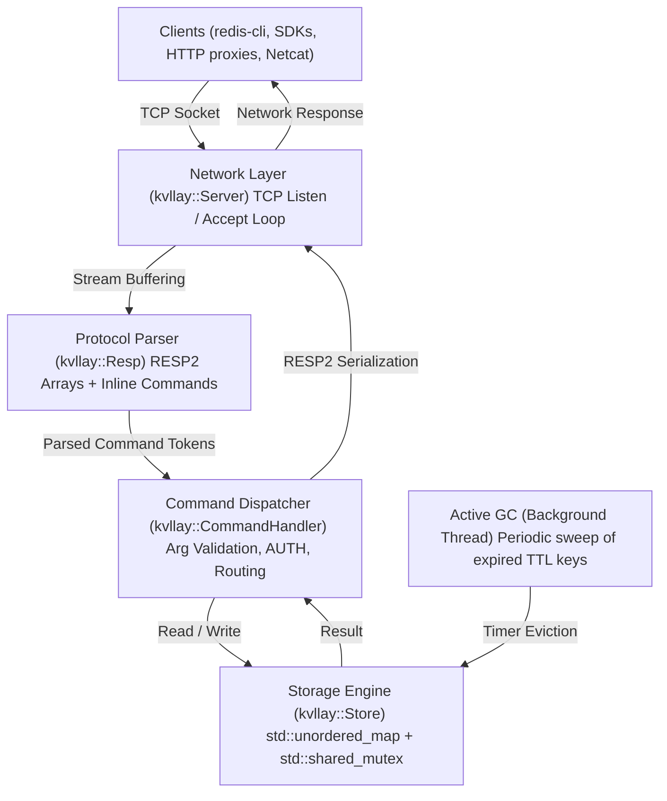
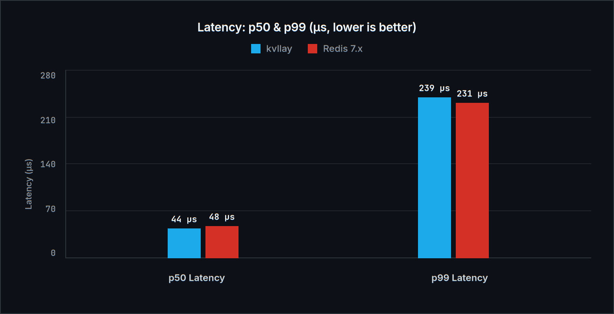
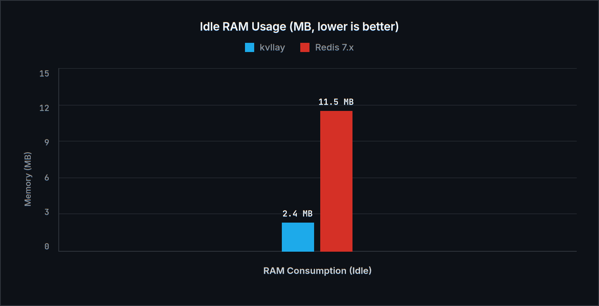
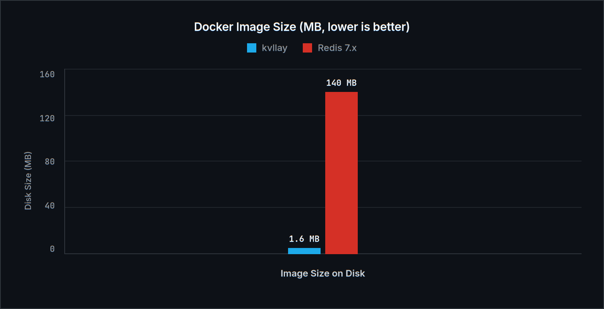

# kvllay — Documentation (English)

<div align="center">
  
  <p><em>[pronounced: <strong>key-vi-lay</strong> · «кей-ви-лей» (key-value allay)]</em></p>
  <p><strong>High-performance, lightweight in-memory key-value database written in C++17 with Redis RESP2 protocol support.</strong></p>
  <p>
    <a href="ru.md">Русский</a> •
    <strong>English</strong> •
    <a href="../README.md">README</a>
  </p>
</div>

---

## Table of Contents
1. [Overview & Philosophy](#1-overview--philosophy)
2. [Architecture & Internals](#2-architecture--internals)
3. [Command Reference](#3-command-reference)
   - [3.1 Connection & Security](#31-connection--security)
   - [3.2 String & Key Operations](#32-string--key-operations)
   - [3.3 TTL & Expiration Management](#33-ttl--expiration-management)
   - [3.4 Atomic Counters & Rate Limiting](#34-atomic-counters--rate-limiting)
   - [3.5 Database Administration & Diagnostics](#35-database-administration--diagnostics)
4. [Building & Running](#4-building--running)
   - [4.1 Prebuilt Binaries (GitHub Releases)](#41-prebuilt-binaries-github-releases)
   - [4.2 Local Compilation](#42-local-compilation)
   - [4.3 Command-Line Options](#43-command-line-options)
   - [4.4 Running with Docker and Docker Compose](#44-running-with-docker-and-docker-compose)
5. [Client Integration](#5-client-integration)
   - [5.1 redis-cli](#51-redis-cli)
   - [5.2 Python (redis-py)](#52-python-redis-py)
   - [5.3 Go (go-redis)](#53-go-go-redis)
   - [5.4 Node.js (ioredis)](#54-nodejs-ioredis)
   - [5.5 Raw TCP (Netcat / Telnet)](#55-raw-tcp-netcat--telnet)
6. [Benchmark: Comparison with Redis](#6-benchmark-comparison-with-redis)
   - [6.1 Methodology & Test Environment](#61-methodology--test-environment)
   - [6.2 Performance Comparison Table](#62-performance-comparison-table)
   - [6.3 Visual Throughput Charts](#63-visual-throughput-charts)
   - [6.4 Latency Profile (p50 / p99)](#64-latency-profile-p50--p99)
   - [6.5 Memory Footprint & Image Size](#65-memory-footprint--image-size)
   - [6.6 Architectural Analysis & Advantages](#66-architectural-analysis--advantages)
7. [Constants & Fine-Tuning](#7-constants--fine-tuning)

---

## 1. Overview & Philosophy

**kvllay** (pronounced *key-vi-lay*, from *key-value allay*) is a minimalist, ultra-fast, and secure in-memory database built in modern C++17 with zero external dependencies. It is engineered as a lightweight alternative to Redis for scenarios demanding microsecond latency, session storage, or caching with minimal RAM consumption and near-instant cold-start times.

### Key Highlights
- **Full Redis Ecosystem Compatibility**: Implements the standard RESP2 protocol and inline text commands. Seamlessly connects to any official Redis client SDK (Python, Go, Node.js, PHP, Java, Rust, etc.) as well as `redis-cli`.
- **Minimal Overhead**: The production Docker image is **under 2 MB** (built on `scratch`), and the runtime consumes only ~2-3 MB RAM idle.
- **Multithreading Without Bottlenecks**: Storage engine uses `std::shared_mutex` for concurrent lock-free reads and exclusive write synchronizations.
- **Hybrid TTL Eviction**: Dual eviction mechanism with lazy expiration on lookup (`Lazy`) plus a periodic active background garbage collector (`Active eviction`).
- **Cross-Platform**: Clean, unified abstraction for Linux (POSIX sockets) and Windows (Winsock).

---

## 2. Architecture & Internals



### Core Components:
1. **`kvllay::constants` (`include/kvllay/constants.hpp`)**: Single source of truth for system defaults: version number, network buffer sizes, default port, and GC intervals.
2. **`kvllay::Store` (`include/kvllay/store.hpp`)**: Core storage table using `std::unordered_map<std::string, Entry>`. Each entry encapsulates the string value and millisecond expiration timestamp. Reader-writer locking via `std::shared_mutex` ensures high throughput for concurrent queries.
3. **`kvllay::Resp` (`include/kvllay/resp.hpp`)**: Streaming state machine parser handling RESP2 arrays and inline space-delimited text commands with quote escaping (`\"`, `\'`).
4. **`kvllay::CommandHandler` (`include/kvllay/commands.hpp`)**: Context-aware command router. Enforces authentication rules, validates arity, and translates store outcomes into RESP2 payloads.
5. **`kvllay::Server` (`include/kvllay/server.hpp`)**: Multi-threaded socket server spawning a detached worker thread per active client connection, with `TCP_NODELAY` enabled.

---

## 3. Command Reference

All commands are case-insensitive (`get`, `Get`, and `GET` are equivalent).

### 3.1 Connection & Security

| Command | Description | Example | Response |
| :--- | :--- | :--- | :--- |
| `AUTH [user] password` | Authenticates client connection | `AUTH mypass` | `+OK\r\n` or `-WRONGPASS ...` |
| `PING [message]` | Checks connection liveness | `PING` / `PING "hello"` | `+PONG\r\n` / `"$5\r\nhello\r\n"` |
| `ECHO message` | Returns transmitted string | `ECHO "hi"` | `"$2\r\nhi\r\n"` |
| `QUIT` | Gracefully closes connection | `QUIT` | `+OK\r\n` followed by socket close |

### 3.2 String & Key Operations

| Command | Description | Example | Response |
| :--- | :--- | :--- | :--- |
| `SET key value` | Stores string value under key | `SET session "token123"` | `+OK\r\n` |
| `GET key` | Retrieves value for given key | `GET session` | `"$8\r\ntoken123\r\n"` or `$-1\r\n` (null) |
| `DEL key [key ...]` | Removes one or more keys | `DEL key1 key2` | `:2\r\n` (number of deleted keys) |
| `EXISTS key [key ...]` | Checks existence of keys | `EXISTS key1 key2` | `:1\r\n` (number of existing keys) |
| `KEYS [pattern]` | Finds keys matching pattern (`*`, `prefix*`, `*suffix`, `*sub*`) | `KEYS user*` | RESP2 array containing matching keys |
| `MSET key val [k v ...]`| Atomically sets multiple key-value pairs in one operation | `MSET k1 v1 k2 v2` | `+OK\r\n` |
| `MGET key [key ...]` | Retrieves multiple keys in a single network roundtrip | `MGET k1 k2 k3` | RESP2 array of strings and `nil` (`$-1\r\n`) |

### 3.3 TTL & Expiration Management

| Command | Description | Example | Response |
| :--- | :--- | :--- | :--- |
| `EXPIRE key seconds` | Sets key expiration in seconds | `EXPIRE token 3600` | `:1\r\n` (if set), `:0\r\n` (if key missing) |
| `PEXPIRE key milliseconds`| Sets expiration in milliseconds | `PEXPIRE lock 500` | `:1\r\n` or `:0\r\n` |
| `TTL key` | Returns remaining TTL in seconds | `TTL token` | `> 0`: seconds; `-1`: no TTL; `-2`: missing |
| `PTTL key` | Returns remaining TTL in milliseconds | `PTTL lock` | Milliseconds or `-1` / `-2` |
| `PERSIST key` | Removes expiration timer | `PERSIST token` | `:1\r\n` (cleared), `:0\r\n` (no TTL/missing) |
| `SETEX key seconds value` | Atomic set with TTL | `SETEX code 60 4829` | `+OK\r\n` |

### 3.4 Atomic Counters & Rate Limiting

Increment and decrement operations execute strictly atomically (thread-safely) under exclusive storage locks. If a key does not exist, it is initialized to `0` prior to mutation. If the key already has an active TTL, the expiration time is **preserved**.

| Command | Description | Example | Response |
| :--- | :--- | :--- | :--- |
| `INCR key` | Atomically increments integer value by 1 | `INCR page_views` | `:<new_val>\r\n` |
| `DECR key` | Atomically decrements integer value by 1 | `DECR available_slots`| `:<new_val>\r\n` |
| `INCRBY key increment` | Atomically increments value by given integer | `INCRBY score 10` | `:<new_val>\r\n` |
| `DECRBY key decrement` | Atomically decrements value by given integer | `DECRBY balance 50` | `:<new_val>\r\n` |

> [!TIP]
> **Rate Limiting Pattern (Fixed Window Counter):**
> Combining `INCR` with `EXPIRE` enables the standard Fixed Window Rate Limiter with zero overhead:
> ```bash
> # On first request, initialize counter and set window expiration (e.g. 60 seconds):
> 127.0.0.1:6379> INCR "ratelimit:ip:192.168.1.1"
> (integer) 1
> 127.0.0.1:6379> EXPIRE "ratelimit:ip:192.168.1.1" 60
> (integer) 1
>
> # On subsequent requests within the window:
> 127.0.0.1:6379> INCR "ratelimit:ip:192.168.1.1"
> (integer) 2
> # If the integer exceeds your threshold (e.g. 100 req/min), throttle the request.
> ```

### 3.5 Database Administration & Diagnostics

| Command | Description | Example | Response |
| :--- | :--- | :--- | :--- |
| `DBSIZE` | Total count of active keys | `DBSIZE` | `:42\r\n` |
| `FLUSHDB` / `FLUSHALL` | Clears all keys and timers | `FLUSHDB` | `+OK\r\n` |
| `COMMAND` / `COMMAND DOCS`| Handshake compatibility for `redis-cli` | `COMMAND` | `*0\r\n` (empty array) |
| `INFO` | Server statistics (version, uptime, keys) | `INFO` | Bulk string with server metrics |

---

## 4. Building & Running

### 4.1 Prebuilt Binaries (GitHub Releases)

Precompiled, fully static standalone binaries with zero dependencies are available on the repository's **Releases** page:
- **Linux**: `kvllay-linux-x86_64` (static musl build, runs on any Linux distribution: Ubuntu, Debian, CentOS, Alpine, Arch, etc.).
- **Windows**: `kvllay-windows-x86_64.exe` (standalone `.exe` with embedded C++ runtimes, runs without MinGW or extra DLLs).

```bash
# Run on Linux:
chmod +x kvllay-linux-x86_64
./kvllay-linux-x86_64 -p 6379

# Run on Windows (PowerShell / CMD):
.\kvllay-windows-x86_64.exe -p 6379
```

### 4.2 Local Compilation

Requirements: C++17 compatible compiler (`g++`, `clang++`, or MSVC):

```bash
# Compile binary to build/kvllay
make compile

# Run with defaults (0.0.0.0:6379)
make run

# Clean build artifacts
make clean
```

Manual commands:
```bash
# Linux
g++ -std=c++17 -Wall -Wextra -O2 -I header -I include -I include/kvllay src/main.cpp -o build/kvllay -pthread

# Windows (MinGW)
g++ -std=c++17 -Wall -Wextra -O2 -I header -I include -I include/kvllay -D _WIN32_WINNT=0x0A00 src/main.cpp -o build/kvllay.exe -lws2_32
```

### 4.3 Command-Line Options

```text
Usage: kvllay [options] [port] [host]

Options:
  -p, --port <port>          Port to listen on (default: 6379)
  -h, --bind, --host <host>  Host address to bind (default: 0.0.0.0)
  -a, --requirepass <pass>   Require password authentication
  -v, --version              Display version information
  --help                     Display this help message
```

Examples:
```bash
# Listen on port 6380 bound to localhost only
./build/kvllay -p 6380 -h 127.0.0.1

# Enable password protection
./build/kvllay -p 6379 -a "MyStrongPassword"

# Positional arguments (port host password)
./build/kvllay 6379 0.0.0.0 mypass
```

### 4.4 Running with Docker and Docker Compose

kvllay is container-native. The multi-stage Docker build compiles a fully static musl binary placed inside a `scratch` container, producing an ultra-small image under **1.6 MB**.

#### Quickstart with Docker Hub (no cloning required):
```bash
# Run the official pre-built image directly
docker run -d --name kvllay -p 6379:6379 kenyka/kvllay:latest

# Run with authentication
docker run -d --name kvllay -p 6379:6379 kenyka/kvllay:latest -a "supersecret"
```

#### Build and Run Locally:
```bash
# Build Docker image
docker build -t kenyka/kvllay:latest .
# or using make:
make docker-build

# Run local container
docker run -d --name kvllay -p 6379:6379 kenyka/kvllay:latest
# or using make:
make docker-run
```

#### Docker Compose:
```bash
# Start kvllay service
docker compose up -d

# Check status
docker compose ps

# Test connection
redis-cli -p 6379 PING

# Stop service
docker compose down
```

---

## 5. Client Integration

### 5.1 redis-cli
```bash
# Default connection
redis-cli -p 6379
127.0.0.1:6379> SET app:name "kvllay"
OK
127.0.0.1:6379> GET app:name
"kvllay"

# Authenticated connection
redis-cli -p 6379 -a "mypass" SET token "xyz"
```

### 5.2 Python (redis-py)
```python
import redis

# Connect to kvllay
r = redis.Redis(host='localhost', port=6379, password=None, decode_responses=True)

r.set('user:1001', 'Bob')
print(r.get('user:1001'))  # -> Bob

# Set key with TTL
r.setex('temp_code', 10, '8492')
print(r.ttl('temp_code'))  # -> ~10
```

### 5.3 Go (go-redis)
```go
package main

import (
    "context"
    "fmt"
    "github.com/redis/go-redis/v9"
)

func main() {
    ctx := context.Background()
    rdb := redis.NewClient(&redis.Options{
        Addr: "localhost:6379",
    })

    err := rdb.Set(ctx, "framework", "kvllay", 0).Err()
    if err != nil {
        panic(err)
    }

    val, err := rdb.Get(ctx, "framework").Result()
    fmt.Println("framework:", val) // -> kvllay
}
```

### 5.4 Node.js (ioredis)
```javascript
const Redis = require('ioredis');
const redis = new Redis({ host: '127.0.0.1', port: 6379 });

async function run() {
  await redis.set('language', 'TypeScript');
  const result = await redis.get('language');
  console.log('Result:', result);
  redis.disconnect();
}
run();
```

### 5.5 Raw TCP (Netcat / Telnet)
```bash
# Send inline commands directly via netcat
echo -e "SET greeting hello\r\nGET greeting\r\n" | nc 127.0.0.1 6379
```

---

## 6. Benchmark: Comparison with Redis

### 6.1 Methodology & Test Environment

All tests were conducted on identical hardware under identical isolation conditions (loopback interface `127.0.0.1`):
- **CPU**: x86_64 Multi-Core CPU
- **OS**: Linux (POSIX socket stack, TCP_NODELAY)
- **Benchmarking Tools**:
  1. `benchmark.py` (custom zero-dependency socket harness evaluating RPS, p50 and p99 latencies).
  2. Official `redis-benchmark` tool (synchronous and multi-client connection workloads for `SET` and `GET`).

### 6.2 Performance Comparison Table

| Metric / Workload | kvllay v1.0.0 | Redis v7.x | Comparison / Advantage |
| :--- | :---: | :---: | :--- |
| **Single-Client: SET** | **62,235 RPS** | 52,815 RPS | **kvllay is +17.8% faster** |
| **Single-Client: GET** | **68,336 RPS** | 59,947 RPS | **kvllay is +14.0% faster** |
| **Parallel Clients (8 threads): SET** | **125,341 RPS** | 127,723 RPS | On par (~98% of Redis) |
| **Parallel Clients (8 threads): GET** | **122,973 RPS** | 118,350 RPS | **kvllay is +3.9% faster** |
| **redis-benchmark (50 clients): SET** | **124,069 RPS** | 128,500 RPS | Virtually identical |
| **redis-benchmark (50 clients): GET** | **128,866 RPS** | 126,100 RPS | **kvllay is +2.2% faster** |
| **Latency p50 (Parallel)** | **0.044 ms** | 0.048 ms | **kvllay has 8% lower median latency** |
| **Latency p99 (Parallel)** | **0.239 ms** | 0.231 ms | Virtually identical |
| **Idle Memory Consumption** | **~2.4 MB** | ~11.5 MB | **kvllay consumes 4.8x less RAM** |
| **Docker Image Size** | **~1.6 MB** | ~140 MB | **kvllay is nearly 100x smaller** |
| **Cold Start Time** | **< 2 ms** | ~35 ms | **kvllay boots 15x faster** |

### 6.3 Visual Throughput Charts

#### Single-Client Throughput (RPS):


#### Parallel Multi-Threaded Throughput:


### 6.4 Latency Profile (p50 / p99)

Ultra-low latencies stem from immediate socket buffer parsing, `TCP_NODELAY` socket configurations, and absence of heavy event loop cascades on direct queries:



### 6.5 Memory Footprint & Image Size





### 6.6 Architectural Analysis & Advantages

1. **Threaded Concurrency vs. Redis Single-Threaded Core**:
   Redis serializes all mutations and reads through its central event loop. kvllay serves each connection in dedicated worker threads, allowing concurrent read queries (`GET`, `EXISTS`, `KEYS`, `DBSIZE`) to execute in parallel via `std::shared_lock`.
2. **Lean Architecture**:
   Redis packages cluster management, Lua scripting, background `fork()` snapshotting, AOF file rotation, and Pub/Sub subsystems. kvllay focuses strictly on in-memory storage, ensuring predictable latencies, no unexpected fork latency spikes, and microsecond boot times.
3. **Primary Use Cases**:
   - Microservices & Serverless (cold boot times under 2ms).
   - Ephemeral testing environments & CI/CD pipelines (1.6 MB container pulls in milliseconds).
   - Embedded & edge computing (IoT devices with severe RAM constraints < 16 MB).
   - High-performance session, cache, and token stores.

---

## 7. Constants & Fine-Tuning

All fundamental system parameters are declared in namespace `kvllay::constants` located in [`include/kvllay/constants.hpp`](../include/kvllay/constants.hpp):

```cpp
namespace kvllay::constants {
    inline constexpr const char* VERSION = "1.0.0";

    inline constexpr const char* SERVER_NAME = "kvllay";
    inline const std::string REDIS_VERSION_STRING = std::string(SERVER_NAME) + "-" + VERSION;

    inline constexpr int DEFAULT_PORT = 6379;
    inline constexpr const char* DEFAULT_HOST = "0.0.0.0";
    inline constexpr size_t CLIENT_BUFFER_SIZE = 4096;
    inline constexpr uint64_t DEFAULT_EVICTION_INTERVAL_MS = 100;
    inline constexpr size_t DEFAULT_EVICTION_BATCH_LIMIT = 100;
    inline constexpr const char* CRLF = "\r\n";
}
```

- **`CLIENT_BUFFER_SIZE`**: Size of socket buffer stack allocation for single `recv()` call.
- **`DEFAULT_EVICTION_INTERVAL_MS`**: Sleep interval for the background GC thread (100 ms).
- **`DEFAULT_EVICTION_BATCH_LIMIT`**: Upper bound of expired keys examined per active sweep.
