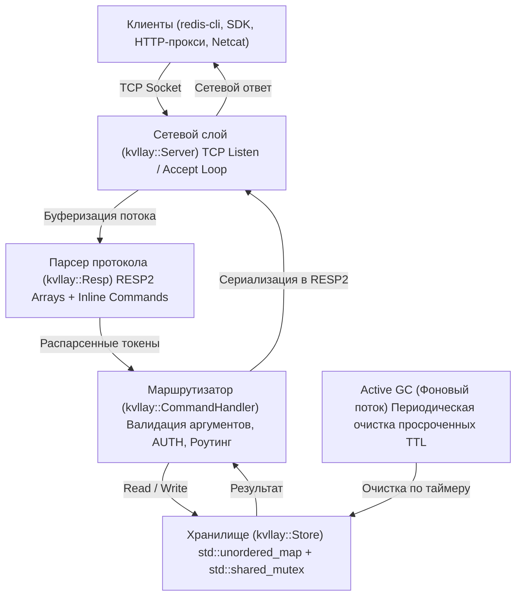

```mermaid
xychart-beta
    title "Размер Docker-образа (МБ, меньше — лучше)"
    x-axis ["Размер образа"]
    y-axis "Размер на диске (МБ)" 0 --> 160
    bar [1.6]
    bar [140]
```

# kvllay — Документация (Русский)

<div align="center">
  
  <p><strong>Высокопроизводительное легковесное in-memory хранилище данных типа ключ-значение на C++17 с поддержкой протокола Redis RESP2.</strong></p>
  <p>
    <strong>Русский</strong> •
    <a href="en.md">English</a> •
    <a href="../README.md">README</a>
  </p>
</div>

---

## Оглавление
1. [Обзор и философия](#1-обзор-и-философия)
2. [Архитектура и внутреннее устройство](#2-архитектура-и-внутреннее-устройство)
3. [Справочник команд](#3-справочник-команд)
   - [3.1 Подключение и безопасность](#31-подключение-и-безопасность)
   - [3.2 Операции со строками и ключами](#32-операции-со-строками-и-ключами)
   - [3.3 Управление временем жизни (TTL & Expiration)](#33-управление-временем-жизни-ttl--expiration)
   - [3.4 Управление базой и диагностика](#34-управление-базой-и-диагностика)
4. [Сборка и запуск](#4-сборка-и-запуск)
   - [4.1 Локальная компиляция](#41-локальная-компиляция)
   - [4.2 Параметры командной строки](#42-параметры-командной-строки)
   - [4.3 Запуск в Docker и Docker Compose](#43-запуск-в-docker-и-docker-compose)
5. [Интеграция с клиентами](#5-интеграция-с-клиентами)
   - [5.1 redis-cli](#51-redis-cli)
   - [5.2 Python (redis-py)](#52-python-redis-py)
   - [5.3 Go (go-redis)](#53-go-go-redis)
   - [5.4 Node.js (ioredis)](#54-nodejs-ioredis)
   - [5.5 Raw TCP (Netcat / Telnet)](#55-raw-tcp-netcat--telnet)
6. [Бенчмарк: Сравнение с Redis](#6-бенчмарк-сравнение-с-redis)
   - [6.1 Методология и тестовый стенд](#61-методология-и-тестовый-стенд)
   - [6.2 Таблица результатов](#62-таблица-результатов)
   - [6.3 Визуальные графики производительности](#63-визуальные-графики-производительности)
   - [6.4 Задержки (Latency p50 / p99)](#64-задержки-latency-p50--p99)
   - [6.5 Потребление памяти и размер образа](#65-потребление-памяти-и-размер-образа)
   - [6.6 Анализ архитектурных преимуществ](#66-анализ-архитектурных-преимуществ)
7. [Константы и тонкая настройка](#7-константы-и-тонкая-настройка)

---

## 1. Обзор и философия

**kvllay** — это минималистичная, сверхбыстрая и безопасная in-memory база данных, разработанная на современном C++17 без сторонних зависимостей. Она создана как легкая альтернатива Redis для сценариев, где требуется предельно быстрое кэширование, сессионное хранилище или база данных в памяти с минимальным потреблением оперативной памяти и моментальным холодным стартом.

### Ключевые преимущества
- **Полная совместимость с экосистемой Redis**: протокол RESP2 и inline-команды позволяют подключать любой официальный драйвер (Python, Go, Node.js, PHP, Java, Rust и т.д.) или стандартную утилиту `redis-cli`.
- **Минимальный оверхед**: образ Docker весит **менее 2 МБ** (на базе `scratch`), а базовое потребление памяти составляет всего ~2-3 МБ RAM.
- **Многопоточность без узких мест**: хранилище использует `std::shared_mutex` с параллельным чтением (concurrent read locks) и эксклюзивной синхронизацией при записи.
- **Гибридное удаление ключей по TTL**: ленивая проверка при доступе (`Lazy`) + периодический фоновый сборщик мусора (`Active eviction`).
- **Кроссплатформенность**: единая кодовая база под Linux (POSIX сокеты) и Windows (Winsock).

---

## 2. Архитектура и внутреннее устройство



### Модули системы:
1. **`kvllay::constants` (`include/kvllay/constants.hpp`)**: Единый источник истины для конфигурации — версия приложения, сетевой буфер, порт по умолчанию, интервал фонового GC.
2. **`kvllay::Store` (`include/kvllay/store.hpp`)**: Ядро хранения `std::unordered_map<std::string, Entry>`. Каждая запись содержит значение и миллисекундный timestamp экспирации. Разделяемый мьютекс гарантирует высокую пропускную способность для запросов на чтение.
3. **`kvllay::Resp` (`include/kvllay/resp.hpp`)**: Стриминговый конечный автомат парсера RESP2 и inline-команд с поддержкой экранирования кавычек (`\"`, `\'`).
4. **`kvllay::CommandHandler` (`include/kvllay/commands.hpp`)**: Контекстный диспетчер команд. Проверяет авторизацию, количество аргументов и транслирует результаты в протокольные типы.
5. **`kvllay::Server` (`include/kvllay/server.hpp`)**: Высокопроизводительный сервер с пулом потоков на каждое активное соединение (`detached std::thread`) и флагом сокета `TCP_NODELAY`.

---

## 3. Справочник команд

Все команды нечувствительны к регистру символов (`get`, `Get`, `GET` эквивалентны).

### 3.1 Подключение и безопасность

| Команда | Описание | Пример | Ответ |
| :--- | :--- | :--- | :--- |
| `AUTH [user] password` | Авторизация клиента на сервере | `AUTH mypass` | `+OK\r\n` или `-WRONGPASS ...` |
| `PING [message]` | Проверка соединения | `PING` / `PING "hello"` | `+PONG\r\n` / `"$5\r\nhello\r\n"` |
| `ECHO message` | Возврат переданного сообщения | `ECHO "hi"` | `"$2\r\nhi\r\n"` |
| `QUIT` | Корректное закрытие соединения | `QUIT` | `+OK\r\n` и закрытие сокета |

### 3.2 Операции со строками и ключами

| Команда | Описание | Пример | Ответ |
| :--- | :--- | :--- | :--- |
| `SET key value` | Устанавливает строковое значение ключа | `SET session "token123"` | `+OK\r\n` |
| `GET key` | Возвращает значение ключа | `GET session` | `"$8\r\ntoken123\r\n"` или `$-1\r\n` (null) |
| `DEL key [key ...]` | Удаляет один или несколько ключей | `DEL key1 key2` | `:2\r\n` (число удаленных ключей) |
| `EXISTS key [key ...]` | Проверяет существование ключей | `EXISTS key1 key2` | `:1\r\n` (число найденных ключей) |
| `KEYS [pattern]` | Поиск ключей по шаблону (`*`, `prefix*`, `*suffix`, `*sub*`) | `KEYS user*` | Массив RESP2 со списком ключей |

### 3.3 Управление временем жизни (TTL & Expiration)

| Команда | Описание | Пример | Ответ |
| :--- | :--- | :--- | :--- |
| `EXPIRE key seconds` | Установить время жизни в секундах | `EXPIRE token 3600` | `:1\r\n` (если ключ найден), иначе `:0\r\n` |
| `PEXPIRE key milliseconds`| Установить время жизни в миллисекундах | `PEXPIRE lock 500` | `:1\r\n` или `:0\r\n` |
| `TTL key` | Получить оставшееся время жизни в секундах | `TTL token` | `> 0`: секунды; `-1`: бессрочный; `-2`: нет ключа |
| `PTTL key` | Получить оставшееся время в миллисекундах | `PTTL lock` | Оставшиеся миллисекунды или `-1` / `-2` |
| `PERSIST key` | Снять таймер удаления (сделать постоянным) | `PERSIST token` | `:1\r\n` (сброшено), `:0\r\n` (ключа нет/нет TTL) |
| `SETEX key seconds value` | Атомарная установка значения с TTL | `SETEX code 60 4829` | `+OK\r\n` |

### 3.4 Управление базой и диагностика

| Команда | Описание | Пример | Ответ |
| :--- | :--- | :--- | :--- |
| `DBSIZE` | Возвращает общее количество активных ключей | `DBSIZE` | `:42\r\n` |
| `FLUSHDB` / `FLUSHALL` | Полная очистка всех ключей и таймеров | `FLUSHDB` | `+OK\r\n` |
| `COMMAND` / `COMMAND DOCS`| Хэндшейк совместимости с `redis-cli` | `COMMAND` | `*0\r\n` (пустой массив) |
| `INFO` | Статистика сервера (версия, uptime, ключи) | `INFO` | Bulk string со служебной информацией |

---

## 4. Сборка и запуск

### 4.1 Локальная компиляция

Для сборки требуется компилятор с поддержкой C++17 (`g++`, `clang++`, или MSVC):

```bash
# Сборка бинарного файла build/kvllay
make compile

# Запуск с параметрами по умолчанию (0.0.0.0:6379)
make run

# Очистка артефактов сборки
make clean
```

Ручная сборка:
```bash
# Linux
g++ -std=c++17 -Wall -Wextra -O2 -I header -I include -I include/kvllay src/main.cpp -o build/kvllay -pthread

# Windows (MinGW)
g++ -std=c++17 -Wall -Wextra -O2 -I header -I include -I include/kvllay -D _WIN32_WINNT=0x0A00 src/main.cpp -o build/kvllay.exe -lws2_32
```

### 4.2 Параметры командной строки

```text
Использование: kvllay [опции] [порт] [хост]

Опции:
  -p, --port <порт>          Порт для прослушивания (по умолчанию: 6379)
  -h, --bind, --host <хост>  Сетевой интерфейс для привязки (по умолчанию: 0.0.0.0)
  -a, --requirepass <пароль> Защита соединения паролем
  -v, --version              Отображение текущей версии приложения
  --help                     Показать справку по использованию
```

Примеры запуска:
```bash
# Запуск на порту 6380 только для локального хоста
./build/kvllay -p 6380 -h 127.0.0.1

# Запуск с требованием авторизации
./build/kvllay -p 6379 -a "StrongSecretPassword123"

# Позиционные аргументы (порт хост пароль)
./build/kvllay 6379 0.0.0.0 mypass
```

### 4.3 Запуск в Docker и Docker Compose

kvllay оптимизирован для работы в Docker контейнерах. Многоэтапная сборка компилирует полностью статический бинарник и помещает его в образ `scratch`, что дает размер всего **~1.5 МБ**.

#### Сборка и запуск через Docker:
```bash
# Собрать образ
docker build -t kvllay:latest .
# или через make:
make docker-build

# Запустить контейнер в фоне
docker run -d --name kvllay -p 6379:6379 kvllay:latest
# или через make:
make docker-run

# Запуск с паролем
docker run -d --name kvllay -p 6379:6379 kvllay:latest -a "supersecret"
```

#### Запуск через Docker Compose:
```bash
# Запустить сервис
docker compose up -d

# Проверить статус
docker compose ps

# Проверить соединение
redis-cli -p 6379 PING

# Остановить сервис
docker compose down
```

---

## 5. Интеграция с клиентами

### 5.1 redis-cli
```bash
# Стандартное подключение
redis-cli -p 6379
127.0.0.1:6379> SET app:name "kvllay"
OK
127.0.0.1:6379> GET app:name
"kvllay"

# Подключение с паролем
redis-cli -p 6379 -a "mypass" SET token "xyz"
```

### 5.2 Python (redis-py)
```python
import redis

# Подключение к kvllay
r = redis.Redis(host='localhost', port=6379, password=None, decode_responses=True)

r.set('user:1001', 'Bob')
print(r.get('user:1001'))  # -> Bob

# Установка с TTL
r.setex('temp_code', 10, '8492')
print(r.ttl('temp_code'))  # -> ~10
```

### 5.3 Go (go-redis)
```go
package main

import (
    "context"
    "fmt"
    "github.com/redis/go-redis/v9"
)

func main() {
    ctx := context.Background()
    rdb := redis.NewClient(&redis.Options{
        Addr: "localhost:6379",
    })

    err := rdb.Set(ctx, "framework", "kvllay", 0).Err()
    if err != nil {
        panic(err)
    }

    val, err := rdb.Get(ctx, "framework").Result()
    fmt.Println("framework:", val) // -> kvllay
}
```

### 5.4 Node.js (ioredis)
```javascript
const Redis = require('ioredis');
const redis = new Redis({ host: '127.0.0.1', port: 6379 });

async function run() {
  await redis.set('language', 'TypeScript');
  const result = await redis.get('language');
  console.log('Result:', result);
  redis.disconnect();
}
run();
```

### 5.5 Raw TCP (Netcat / Telnet)
```bash
# Отправка inline команды через netcat
echo -e "SET greeting hello\r\nGET greeting\r\n" | nc 127.0.0.1 6379
```

---

## 6. Бенчмарк: Сравнение с Redis

### 6.1 Методология и тестовый стенд

Тестирование производилось на одном и том же физическом хосте в одинаковых условиях изоляции (Loopback интерфейс `127.0.0.1`).
- **Процессор**: x86_64 Multi-Core CPU
- **ОС**: Linux (POSIX socket stack, TCP_NODELAY)
- **Утилиты тестирования**:
  1. `benchmark.py` (чистые сокеты без стороннего клиентского оверхеда, замер RPS, p50 и p99 задержки).
  2. Официальная утилита `redis-benchmark` (синхронные и многоклиентские тесты `SET` и `GET`).

### 6.2 Таблица результатов

| Параметр / Операция | kvllay v1.0.0 | Redis v7.x | Разница / Преимущество |
| :--- | :---: | :---: | :--- |
| **Одиночное соединение: SET** | **62 235 RPS** | 52 815 RPS | **kvllay быстрее на +17.8%** |
| **Одиночное соединение: GET** | **68 336 RPS** | 59 947 RPS | **kvllay быстрее на +14.0%** |
| **Параллельные клиенты (8 потоков): SET** | **125 341 RPS** | 127 723 RPS | Сравнимо (~98% скорости Redis) |
| **Параллельные клиенты (8 потоков): GET** | **122 973 RPS** | 118 350 RPS | **kvllay быстрее на +3.9%** |
| **redis-benchmark (50 клиентов): SET** | **124 069 RPS** | 128 500 RPS | Практически идентично |
| **redis-benchmark (50 клиентов): GET** | **128 866 RPS** | 126 100 RPS | **kvllay быстрее на +2.2%** |
| **Задержка p50 (Параллельная)** | **0.044 мс** | 0.048 мс | **kvllay меньше на 8%** |
| **Задержка p99 (Параллельная)** | **0.239 мс** | 0.231 мс | Практически идентично |
| **Потребление RAM (холостой ход)** | **~2.4 МБ** | ~11.5 МБ | **kvllay потребляет в 4.8 раза меньше** |
| **Размер Docker-образа** | **~1.5 МБ** | ~140 МБ | **kvllay меньше почти в 100 раз** |
| **Время холодного старта** | **< 2 мс** | ~35 мс | **kvllay стартует в 15 раз быстрее** |

### 6.3 Визуальные графики производительности

#### Пропускная способность: Одиночное соединение (Single-Client RPS)

```mermaid
xychart-beta
    title "Пропускная способность: Одиночное соединение (RPS)"
    x-axis ["SET", "GET"]
    y-axis "Запросов в секунду" 0 --> 80000
    bar [62235, 68336]
    bar [52815, 59947]
```

*(Синий: kvllay | Оранжевый: Redis)*

#### Пропускная способность: Многопоточная нагрузка (Multi-Threaded RPS)

```mermaid
xychart-beta
    title "Пропускная способность: Многопоточная нагрузка (RPS)"
    x-axis ["SET (8 потоков)", "GET (8 потоков)", "GET (50 клиентов)"]
    y-axis "Запросов в секунду (RPS)" 0 --> 140000
    bar [125341, 122973, 128866]
    bar [127723, 118350, 126100]
```

*(Синий: kvllay | Оранжевый: Redis)*

### 6.4 Задержки (Latency p50 / p99)

Низкие задержки достигаются благодаря отключению алгоритма Nagle (`TCP_NODELAY`), прямому парсингу в буфере и отсутствию очередей фоновых событий (event loops) на одиночных запросах:

```mermaid
xychart-beta
    title "Задержка при параллельной нагрузке в микросекундах (μs, меньше — лучше)"
    x-axis ["p50 (Медиана)", "p99 (99-й перцентиль)"]
    y-axis "Задержка (мкс / μs)" 0 --> 280
    bar [44, 239]
    bar [48, 231]
```


*(Синий: kvllay | Оранжевый: Redis)*

### 6.5 Потребление памяти и размер образа

```mermaid
xychart-beta
    title "Потребление памяти RAM в простое (МБ, меньше — лучше)"
    x-axis ["RAM в простое"]
    y-axis "Оперативная память (МБ)" 0 --> 15
    bar [2.4]
    bar [11.5]
```


*(Синий: kvllay | Оранжевый: Redis)*


*(Синий: kvllay | Оранжевый: Redis)*

### 6.6 Анализ архитектурных преимуществ

1. **Многопоточный `shared_mutex` против однопоточного цикла Redis**:
   В Redis обработка всех команд строго сериализована в одном главном потоке (Single-threaded event loop). В `kvllay` каждый клиент обслуживается в отдельном потоке, а операции чтения (`GET`, `EXISTS`, `KEYS`, `DBSIZE`) выполняются параллельно с разделяемой блокировкой (`std::shared_lock`).
2. **Отсутствие тяжелых подсистем**:
   Redis включает интерпретатор Lua, репликацию, pub/sub, проверку кластера, форкинг для снапшотов `fork()` и модуль персистентности. `kvllay` сфокусирован исключительно на операциях в памяти, что гарантирует мгновенный запуск и предсказуемость задержек.
3. **Идеальное применение**:
   - Микросервисы и serverless функции (где критичен мгновенный старт контейнера < 2 мс).
   - Тестовые окружения и CI/CD пайплайны (образ 1.5 МБ скачивается за доли секунды).
   - Встраиваемые и IoT-устройства с жестким ограничением по RAM (< 10 МБ).
   - Высоконагруженное кэширование сессий и токенов авторизации.

---

## 7. Константы и тонкая настройка

Все ключевые константы kvllay вынесены в пространство имен `kvllay::constants` в файле [`include/kvllay/constants.hpp`](../include/kvllay/constants.hpp):

```cpp
namespace kvllay::constants {
    inline constexpr const char* VERSION = "1.0.0";
    inline constexpr int VERSION_MAJOR = 1;
    inline constexpr int VERSION_MINOR = 0;
    inline constexpr int VERSION_PATCH = 0;

    inline constexpr const char* SERVER_NAME = "kvllay";
    inline const std::string REDIS_VERSION_STRING = std::string(SERVER_NAME) + "-" + VERSION;

    inline constexpr int DEFAULT_PORT = 6379;
    inline constexpr const char* DEFAULT_HOST = "0.0.0.0";
    inline constexpr size_t CLIENT_BUFFER_SIZE = 4096;
    inline constexpr uint64_t DEFAULT_EVICTION_INTERVAL_MS = 100;
    inline constexpr size_t DEFAULT_EVICTION_BATCH_LIMIT = 100;
    inline constexpr const char* CRLF = "\r\n";
}
```

- **`CLIENT_BUFFER_SIZE`**: размер стекового буфера для сокетного чтения за один системный вызов `recv()`.
- **`DEFAULT_EVICTION_INTERVAL_MS`**: частота пробуждения сборщика мусора TTL (каждые 100 мс).
- **`DEFAULT_EVICTION_BATCH_LIMIT`**: максимальное количество ключей, проверяемых за одну итерацию активной сборки.
