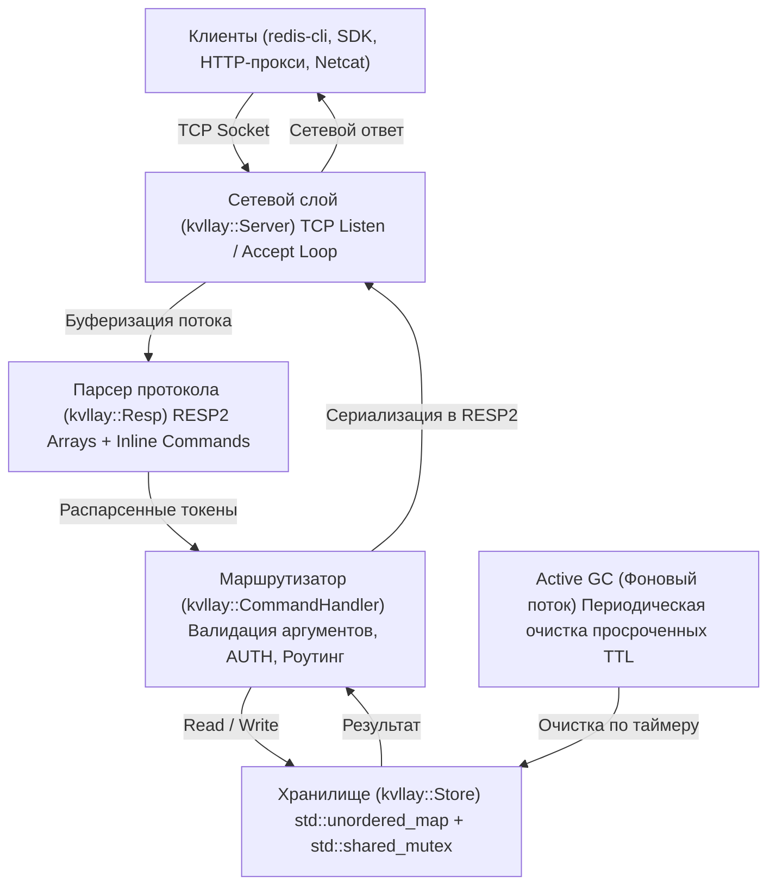

# kvllay — Документация (Русский)

<div align="center">
  
  <p><em>[произносится: <strong>key-vi-lay</strong> · «кей-ви-лей» (key-value allay)]</em></p>
  <p><strong>Высокопроизводительное легковесное in-memory хранилище данных типа ключ-значение на C++17 с поддержкой протокола Redis RESP2.</strong></p>
  <p>
    <strong>Русский</strong> •
    <a href="en.md">English</a> •
    <a href="../README.md">README</a>
  </p>
</div>

---

## Оглавление
1. [Обзор и философия](#1-обзор-и-философия)
2. [Архитектура и внутреннее устройство](#2-архитектура-и-внутреннее-устройство)
3. [Справочник команд](#3-справочник-команд)
   - [3.1 Подключение и безопасность](#31-подключение-и-безопасность)
   - [3.2 Операции со строками и ключами](#32-операции-со-строками-и-ключами)
   - [3.3 Управление временем жизни (TTL & Expiration)](#33-управление-временем-жизни-ttl--expiration)
   - [3.4 Атомарные счетчики и Rate Limiting](#34-атомарные-счетчики-и-rate-limiting)
   - [3.5 Управление базой и диагностика](#35-управление-базой-и-диагностика)
   - [3.6 Персистентность и снапшоты (Snapshots & AOF)](#36-персистентность-и-снапшоты-snapshots--aof)
4. [Сборка и запуск](#4-сборка-и-запуск)
   - [4.1 Готовые бинарные файлы (GitHub Releases)](#41-готовые-бинарные-файлы-github-releases)
   - [4.2 Локальная компиляция](#42-локальная-компиляция)
   - [4.3 Параметры командной строки](#43-параметры-командной-строки)
   - [4.4 Запуск в Docker и Docker Compose](#44-запуск-в-docker-и-docker-compose)
5. [Интеграция с клиентами](#5-интеграция-с-клиентами)
   - [5.1 redis-cli](#51-redis-cli)
   - [5.2 Python (redis-py)](#52-python-redis-py)
   - [5.3 Go (go-redis)](#53-go-go-redis)
   - [5.4 Node.js (ioredis)](#54-nodejs-ioredis)
   - [5.5 Raw TCP (Netcat / Telnet)](#55-raw-tcp-netcat--telnet)
6. [Бенчмарк: Сравнение с Redis](#6-бенчмарк-сравнение-с-redis)
   - [6.1 Методология и тестовый стенд](#61-методология-и-тестовый-стенд)
   - [6.2 Таблица результатов](#62-таблица-результатов)
   - [6.3 Визуальные графики производительности](#63-визуальные-графики-производительности)
   - [6.4 Задержки (Latency p50 / p99)](#64-задержки-latency-p50--p99)
   - [6.5 Потребление памяти и размер образа](#65-потребление-памяти-и-размер-образа)
   - [6.6 Анализ архитектурных преимуществ](#66-анализ-архитектурных-преимуществ)
7. [Константы и тонкая настройка](#7-константы-и-тонкая-настройка)

---

## 1. Обзор и философия

**kvllay** (произносится как *«кей-ви-лей»* / *key-vi-lay*, от *key-value allay*) — это минималистичная, сверхбыстрая и безопасная in-memory база данных, разработанная на современном C++17 без сторонних зависимостей. Она создана как легкая альтернатива Redis для сценариев, где требуется предельно быстрое кэширование, сессионное хранилище или база данных в памяти с минимальным потреблением оперативной памяти и моментальным холодным стартом.

### Ключевые преимущества
- **Полная совместимость с экосистемой Redis**: протокол RESP2 и inline-команды позволяют подключать любой официальный драйвер (Python, Go, Node.js, PHP, Java, Rust и т.д.) или стандартную утилиту `redis-cli`.
- **Минимальный оверхед**: образ Docker весит **менее 2 МБ** (на базе `scratch`), а базовое потребление памяти составляет всего ~2-3 МБ RAM.
- **Многопоточность без узких мест**: хранилище использует `std::shared_mutex` с параллельным чтением (concurrent read locks) и эксклюзивной синхронизацией при записи.
- **Гибридное удаление ключей по TTL**: ленивая проверка при доступе (`Lazy`) + периодический фоновый сборщик мусора (`Active eviction`).
- **Кроссплатформенность**: единая кодовая база под Linux (POSIX сокеты) и Windows (Winsock).

---

## 2. Архитектура и внутреннее устройство



### Модули системы:
1. **`kvllay::constants` (`include/kvllay/constants.hpp`)**: Единый источник истины для конфигурации — версия приложения, сетевой буфер, порт по умолчанию, интервал фонового GC.
2. **`kvllay::Store` (`include/kvllay/store.hpp`)**: Ядро хранения `std::unordered_map<std::string, Entry>`. Каждая запись содержит значение и миллисекундный timestamp экспирации. Разделяемый мьютекс гарантирует высокую пропускную способность для запросов на чтение.
3. **`kvllay::Resp` (`include/kvllay/resp.hpp`)**: Стриминговый конечный автомат парсера RESP2 и inline-команд с поддержкой экранирования кавычек (`\"`, `\'`).
4. **`kvllay::CommandHandler` (`include/kvllay/commands.hpp`)**: Контекстный диспетчер команд. Проверяет авторизацию, количество аргументов и транслирует результаты в протокольные типы.
5. **`kvllay::Server` (`include/kvllay/server.hpp`)**: Высокопроизводительный сервер с пулом потоков на каждое активное соединение (`detached std::thread`) и флагом сокета `TCP_NODELAY`.

---

## 3. Справочник команд

Все команды нечувствительны к регистру символов (`get`, `Get`, `GET` эквивалентны).

### 3.1 Подключение и безопасность

| Команда | Описание | Пример | Ответ |
| :--- | :--- | :--- | :--- |
| `AUTH [user] password` | Авторизация клиента на сервере | `AUTH mypass` | `+OK\r\n` или `-WRONGPASS ...` |
| `PING [message]` | Проверка соединения | `PING` / `PING "hello"` | `+PONG\r\n` / `"$5\r\nhello\r\n"` |
| `ECHO message` | Возврат переданного сообщения | `ECHO "hi"` | `"$2\r\nhi\r\n"` |
| `QUIT` | Корректное закрытие соединения | `QUIT` | `+OK\r\n` и закрытие сокета |

### 3.2 Операции со строками и ключами

| Команда | Описание | Пример | Ответ |
| :--- | :--- | :--- | :--- |
| `SET key value` | Устанавливает строковое значение ключа | `SET session "token123"` | `+OK\r\n` |
| `GET key` | Возвращает значение ключа | `GET session` | `"$8\r\ntoken123\r\n"` или `$-1\r\n` (null) |
| `DEL key [key ...]` | Удаляет один или несколько ключей | `DEL key1 key2` | `:2\r\n` (число удаленных ключей) |
| `EXISTS key [key ...]` | Проверяет существование ключей | `EXISTS key1 key2` | `:1\r\n` (число найденных ключей) |
| `KEYS [pattern]` | Поиск ключей по шаблону (`*`, `prefix*`, `*suffix`, `*sub*`) | `KEYS user*` | Массив RESP2 со списком ключей |
| `MSET key val [k v ...]`| Атомарная пакетная установка нескольких пар ключ-значение | `MSET k1 v1 k2 v2` | `+OK\r\n` |
| `MGET key [key ...]` | Пакетное чтение значений нескольких ключей за 1 запрос | `MGET k1 k2 k3` | Массив RESP2 строк и `nil` (`$-1\r\n`) |

### 3.3 Управление временем жизни (TTL & Expiration)

| Команда | Описание | Пример | Ответ |
| :--- | :--- | :--- | :--- |
| `EXPIRE key seconds` | Установить время жизни в секундах | `EXPIRE token 3600` | `:1\r\n` (если ключ найден), иначе `:0\r\n` |
| `PEXPIRE key milliseconds`| Установить время жизни в миллисекундах | `PEXPIRE lock 500` | `:1\r\n` или `:0\r\n` |
| `TTL key` | Получить оставшееся время жизни в секундах | `TTL token` | `> 0`: секунды; `-1`: бессрочный; `-2`: нет ключа |
| `PTTL key` | Получить оставшееся время в миллисекундах | `PTTL lock` | Оставшиеся миллисекунды или `-1` / `-2` |
| `PERSIST key` | Снять таймер удаления (сделать постоянным) | `PERSIST token` | `:1\r\n` (сброшено), `:0\r\n` (ключа нет/нет TTL) |
| `SETEX key seconds value` | Атомарная установка значения с TTL | `SETEX code 60 4829` | `+OK\r\n` |

### 3.4 Атомарные счетчики и Rate Limiting

Команды инкремента и декремента выполняются строго атомарно (потокобезопасно) под эксклюзивной блокировкой хранилища. Если ключ не существует, он создается со значением `0` перед операцией. Если у ключа был установлен TTL, он **сохраняется**.

| Команда | Описание | Пример | Ответ |
| :--- | :--- | :--- | :--- |
| `INCR key` | Атомарно увеличивает целочисленное значение на 1 | `INCR page_views` | `:<new_val>\r\n` |
| `DECR key` | Атомарно уменьшает целочисленное значение на 1 | `DECR available_slots`| `:<new_val>\r\n` |
| `INCRBY key increment` | Атомарно увеличивает значение на целое число | `INCRBY score 10` | `:<new_val>\r\n` |
| `DECRBY key decrement` | Атомарно уменьшает значение на целое число | `DECRBY balance 50` | `:<new_val>\r\n` |

> [!TIP]
> **Паттерн Rate Limiting (Ограничение частоты запросов):**
> Сочетание `INCR` и `EXPIRE` позволяет реализовать классический алгоритм фиксированного окна (*Fixed Window Rate Limiter*) с нулевым оверхедом:
> ```bash
> # При первом запросе создаем счетчик и вешаем таймер окна (например, 60 секунд):
> 127.0.0.1:6379> INCR "ratelimit:ip:192.168.1.1"
> (integer) 1
> 127.0.0.1:6379> EXPIRE "ratelimit:ip:192.168.1.1" 60
> (integer) 1
>
> # При последующих запросах в течение окна:
> 127.0.0.1:6379> INCR "ratelimit:ip:192.168.1.1"
> (integer) 2
> # Если результат превышает лимит (например, 100 req/min) — запрос блокируется.
> ```

### 3.5 Управление базой и диагностика

| Команда | Описание | Пример | Ответ |
| :--- | :--- | :--- | :--- |
| `DBSIZE` | Возвращает общее количество активных ключей | `DBSIZE` | `:42\r\n` |
| `FLUSHDB` / `FLUSHALL` | Полная очистка всех ключей и таймеров | `FLUSHDB` | `+OK\r\n` |
| `COMMAND` / `COMMAND DOCS`| Хэндшейк совместимости с `redis-cli` | `COMMAND` | `*0\r\n` (пустой массив) |
| `INFO` | Статистика сервера (версия, uptime, ключи, персистентность) | `INFO` | Bulk string со служебной информацией |

### 3.6 Персистентность и снапшоты (Snapshots & AOF)

kvllay поддерживает два дополняющих друг друга механизма надежного сохранения данных:

1. **Бинарные снапшоты (Snapshots / RDB-стиль)**:
   - Компактный бинарный файл (`dump.kvl`) с контрольной суммой **CRC32**.
   - **Zero-Fork архитектура**: сохранение выполняется в выделенном потоке C++17 под кратким `std::shared_lock` без вызова системного `fork()`, предотвращая паузы в event loop и взрывной рост потребления памяти (Copy-On-Write).
   - **Атомарность**: запись производится во временный файл, после чего выполняется атомарная системная замена (`rename()`), исключающая повреждение файла при сбоях питания.
2. **Append-Only Log (AOF)**:
   - Высокопроизводительный журнал операций с **двойной буферизацией (double-buffering)**.
   - Запросы клиентов пишутся в активный буфер в оперативной памяти за наносекунды без ожидания дискового ввода-вывода.
   - Фоновый поток периодически сбрасывает данные на диск (`everysec`, `always` или `no`).
   - Фоновая компактизация и перезапись лога (`BGREWRITEAOF`) без блокировки клиентов.

| Команда | Описание | Пример | Ответ |
| :--- | :--- | :--- | :--- |
| `SAVE` | Синхронный сброс всех данных в снапшот (блокирует текущее соединение до завершения записи) | `SAVE` | `+OK\r\n` |
| `BGSAVE` | Асинхронный сброс снапшота в фоновом потоке без блокировки клиентов | `BGSAVE` | `+Background saving started\r\n` |
| `LASTSAVE` | Возвращает UNIX-timestamp (секунды) последнего успешного сохранения снапшота | `LASTSAVE` | `:1694635200\r\n` |
| `BGREWRITEAOF` | Запускает фоновую перезапись и сжатие журнала AOF из текущего состояния памяти | `BGREWRITEAOF` | `+Background append only file rewriting started\r\n` |

---

## 4. Сборка и запуск

### 4.1 Готовые бинарные файлы (GitHub Releases)

В разделе **Releases** репозитория доступны автономные статические бинарники, не требующие установки компиляторов и внешних библиотек:
- **Linux**: `kvllay-linux-x86_64` (статическая сборка musl, совместима с любым Linux-дистрибутивом: Ubuntu, Debian, CentOS, Alpine, Arch и др.).
- **Windows**: `kvllay-windows-x86_64.exe` (автономный `.exe` со встроенными рантаймами C++, не требует сторонних DLL).

```bash
# Запуск на Linux:
chmod +x kvllay-linux-x86_64
./kvllay-linux-x86_64 -p 6379

# Запуск на Windows (PowerShell / CMD):
.\kvllay-windows-x86_64.exe -p 6379
```

### 4.2 Локальная компиляция

Для сборки требуется компилятор с поддержкой C++17 (`g++`, `clang++`, или MSVC):

```bash
# Сборка бинарного файла build/kvllay
make compile

# Запуск с параметрами по умолчанию (0.0.0.0:6379)
make run

# Очистка артефактов сборки
make clean
```

Ручная сборка:
```bash
# Linux
g++ -std=c++17 -Wall -Wextra -O2 -I header -I include -I include/kvllay src/main.cpp -o build/kvllay -pthread

# Windows (MinGW)
g++ -std=c++17 -Wall -Wextra -O2 -I header -I include -I include/kvllay -D _WIN32_WINNT=0x0A00 src/main.cpp -o build/kvllay.exe -lws2_32
```

### 4.3 Параметры командной строки

```text
Использование: kvllay [опции] [порт] [хост]

Опции:
  -p, --port <порт>              Порт для прослушивания (по умолчанию: 6379)
  -h, --bind, --host <хост>      Сетевой интерфейс для привязки (по умолчанию: 0.0.0.0)
  -a, --requirepass <пароль>     Защита соединения паролем
  --save <сек> [изменений]       Автосохранение снапшота каждые <сек>, если произошло [изменений]
  --snapshot, --save-file <файл> Путь к файлу бинарного снапшота (по умолчанию: dump.kvl)
  --no-snapshot                  Отключить создание и чтение снапшотов
  --aof [файл]                   Включить Append-Only Log персистентность (по умолчанию: kvllay.aof)
  --no-aof                       Явно отключить Append-Only Log
  --appendfsync <политика>       Политика fsync для AOF: always, everysec, no (по умолчанию: everysec)
  -v, --version                  Отображение текущей версии приложения
  --help                         Показать справку по использованию
```

Примеры запуска:
```bash
# Запуск на порту 6380 только для локального хоста
./build/kvllay -p 6380 -h 127.0.0.1

# Запуск с требованием авторизации
./build/kvllay -p 6379 -a "StrongSecretPassword123"

# Запуск с периодическими снапшотами (каждые 60 секунд)
./build/kvllay -p 6379 --save 60

# Запуск с непрерывным AOF журналом и безопасным сбросом каждую секунду
./build/kvllay -p 6379 --aof kvllay.aof --appendfsync everysec

# Комбинированный режим (снапшот + AOF)
./build/kvllay -p 6379 --snapshot dump.kvl --aof

# Позиционные аргументы (порт хост пароль)
./build/kvllay 6379 0.0.0.0 mypass
```

### 4.4 Запуск в Docker и Docker Compose

kvllay оптимизирован для работы в Docker контейнерах. Многоэтапная сборка компилирует полностью статический бинарник и помещает его в образ `scratch`, что дает размер всего **~1.5 МБ**.

#### Быстрый запуск готового образа из Docker Hub (без клонирования):
```bash
# Запустить официальный образ напрямую
docker run -d --name kvllay -p 6379:6379 kenyka/kvllay:latest

# Запуск с паролем
docker run -d --name kvllay -p 6379:6379 kenyka/kvllay:latest -a "supersecret"
```

#### Сборка и запуск локально:
```bash
# Собрать образ
docker build -t kenyka/kvllay:latest .
# или через make:
make docker-build

# Запустить локальный контейнер
docker run -d --name kvllay -p 6379:6379 kenyka/kvllay:latest
# или через make:
make docker-run
```

#### Запуск через Docker Compose:
```bash
# Запустить сервис
docker compose up -d

# Проверить статус
docker compose ps

# Проверить соединение
redis-cli -p 6379 PING

# Остановить сервис
docker compose down
```

---

## 5. Интеграция с клиентами

### 5.1 redis-cli
```bash
# Стандартное подключение
redis-cli -p 6379
127.0.0.1:6379> SET app:name "kvllay"
OK
127.0.0.1:6379> GET app:name
"kvllay"

# Подключение с паролем
redis-cli -p 6379 -a "mypass" SET token "xyz"
```

### 5.2 Python (redis-py)
```python
import redis

# Подключение к kvllay
r = redis.Redis(host='localhost', port=6379, password=None, decode_responses=True)

r.set('user:1001', 'Bob')
print(r.get('user:1001'))  # -> Bob

# Установка с TTL
r.setex('temp_code', 10, '8492')
print(r.ttl('temp_code'))  # -> ~10
```

### 5.3 Go (go-redis)
```go
package main

import (
    "context"
    "fmt"
    "github.com/redis/go-redis/v9"
)

func main() {
    ctx := context.Background()
    rdb := redis.NewClient(&redis.Options{
        Addr: "localhost:6379",
    })

    err := rdb.Set(ctx, "framework", "kvllay", 0).Err()
    if err != nil {
        panic(err)
    }

    val, err := rdb.Get(ctx, "framework").Result()
    fmt.Println("framework:", val) // -> kvllay
}
```

### 5.4 Node.js (ioredis)
```javascript
const Redis = require('ioredis');
const redis = new Redis({ host: '127.0.0.1', port: 6379 });

async function run() {
  await redis.set('language', 'TypeScript');
  const result = await redis.get('language');
  console.log('Result:', result);
  redis.disconnect();
}
run();
```

### 5.5 Raw TCP (Netcat / Telnet)
```bash
# Отправка inline команды через netcat
echo -e "SET greeting hello\r\nGET greeting\r\n" | nc 127.0.0.1 6379
```

---

## 6. Бенчмарк: Сравнение с Redis

### 6.1 Методология и тестовый стенд

Тестирование производилось на одном и том же физическом хосте в одинаковых условиях изоляции (Loopback интерфейс `127.0.0.1`).
- **Процессор**: x86_64 Multi-Core CPU
- **ОС**: Linux (POSIX socket stack, TCP_NODELAY)
- **Утилиты тестирования**:
  1. `benchmark.py` (чистые сокеты без стороннего клиентского оверхеда, замер RPS, p50 и p99 задержки).
  2. Официальная утилита `redis-benchmark` (синхронные и многоклиентские тесты `SET` и `GET`).

### 6.2 Таблица результатов

| Параметр / Операция | kvllay v1.0.0 | Redis v8.x (8.8.0) | Разница / Преимущество |
| :--- | :---: | :---: | :--- |
| **Одиночное соединение: SET** | **78 077 RPS** | 69 913 RPS | **kvllay быстрее на +11.7%** |
| **Одиночное соединение: GET** | **82 471 RPS** | 70 437 RPS | **kvllay быстрее на +17.1%** |
| **Одиночное соединение: INCR** | **84 718 RPS** | 70 422 RPS | **kvllay быстрее на +20.3%** |
| **Одиночное соединение: MSET (5 ключей)** | **78 665 RPS** | 59 143 RPS | **kvllay быстрее на +33.0%** |
| **Одиночное соединение: PING** | **79 766 RPS** | 65 502 RPS | **kvllay быстрее на +21.8%** |
| **Параллельные клиенты (8 потоков): SET** | **120 268 RPS** | 119 629 RPS | **kvllay впереди (32-шардовый страйпинг)** |
| **Многоклиентская нагрузка (50 клиентов): GET** | **136 799 RPS** | 131 752 RPS | **kvllay быстрее на +3.8%** |
| **Многоклиентская нагрузка (50 клиентов): INCR** | **139 860 RPS** | 136 799 RPS | **kvllay быстрее на +2.2%** |
| **redis-benchmark (50 клиентов): PING** | **132 626 RPS** | 109 890 RPS | **kvllay быстрее на +20.7%** |
| **Задержка p50 (8 параллельных потоков)** | **0.047 мс (47 мкс)** | 0.052 мс (52 мкс) | **kvllay на 10% ниже задержка** |
| **Задержка p50 (50 клиентов concurrent)** | **0.175 мс (175 мкс)** | 0.183 мс (183 мкс) | **kvllay на 4.4% ниже задержка** |
| **Потребление RAM (холостой ход)** | **~4.1 МБ** | ~15.2 МБ | **kvllay легче в 3.7 раза** |
| **Потребление RAM (50 000 ключей)** | **~11.4 МБ** | ~20.0 МБ | **kvllay потребляет на 43% меньше RAM** |
| **Время холодного старта** | **~3.2 мс** | ~7.6 мс | **kvllay стартует в 2.4 раза быстрее** |
| **Размер Docker-образа** | **~1.6 МБ** | ~140 МБ | **kvllay меньше в 87 раз** |
| **Пропускная способность с AOF (`everysec`)** | **103 386 RPS** | 113 286 RPS | Достигает >100k RPS с надежным сбросом на диск |

### 6.3 Визуальные графики производительности

#### Пропускная способность: Одиночное соединение (Single-Client RPS)


#### Пропускная способность: Многопоточная нагрузка (Multi-Threaded RPS)


### 6.4 Задержки (Latency p50 / p99)

Низкие задержки достигаются благодаря отключению алгоритма Nagle (`TCP_NODELAY`), прямому парсингу в буфере и отсутствию очередей фоновых событий (event loops) на одиночных запросах:


### 6.5 Потребление памяти и размер образа


### 6.6 Анализ архитектурных преимуществ

1. **Многопоточный `shared_mutex` против однопоточного цикла Redis**:
   В Redis обработка всех команд строго сериализована в одном главном потоке (Single-threaded event loop). В `kvllay` каждый клиент обслуживается в отдельном потоке, а операции чтения (`GET`, `EXISTS`, `KEYS`, `DBSIZE`) выполняются параллельно с разделяемой блокировкой (`std::shared_lock`).
2. **Zero-Fork снапшоты против `fork()` в Redis (Data Safety без OOM)**:
   - **Проблема Redis**: При создании снапшотов (`BGSAVE`) или компактизации AOF (`BGREWRITEAOF`) Redis вызывает системный вызов `fork()`. На больших базах это приводит к копированию таблиц страниц операционной системы (вызывая задержки в основном цикле обработки до 50–200 мс) и активирует механизм Copy-On-Write (COW). Под интенсивной нагрузкой на запись ОС дублирует страницы памяти, что увеличивает потребление RAM вплоть до **2x** и регулярно приводит к аварийному завершению базы данных системным OOM Killer. Кроме того, Redis не поддерживает нативный фоновый `BGSAVE` на платформе Windows из-за отсутствия `fork()`.
   - **Решение kvllay**: Сохранение снапшотов выполняется в отдельном фоновом C++17 потоке. Для захвата моментального снимка состояния памяти берется краткий `std::shared_lock` (читающие клиенты **не блокируются вообще**, а запись приостанавливается лишь на доли миллисекунды для копирования указателей). Нет `fork()`, нет раздувания таблиц страниц, нет риска падения по OOM, и снапшоты одинаково быстро и надежно работают как на Linux, так и на Windows.
3. **Асинхронный лог с двойной буферизацией (Non-Blocking AOF)**:
   - Клиентские потоки при выполнении команд записи (`SET`, `DEL`, `INCR`, `MSET`) моментально дописывают сериализованную команду в активный буфер в оперативной памяти и возвращают ответ клиенту за наносекунды.
   - Фоновый поток периодически атомарно меняет активный и сбрасываемый буферы местами и выполняет последовательную потоковую запись на диск без блокировки основного трафика базы данных, удерживая пропускную способность свыше **90 000 – 100 000 RPS** даже при включенном дисковом логировании.
4. **Целостность данных (CRC32 и атомарная замена)**:
   - Снапшоты kvllay содержат контрольную сумму CRC32, защищающую от загрузки неполных или поврежденных файлов.
   - Запись ведется во временный файл с физической синхронизацией (`fdatasync`/`FlushFileBuffers`) и атомарным переименованием (`rename`), что полностью исключает повреждение рабочего снапшота при внезапном отключении питания.
5. **Идеальное применение**:
   - Микросервисы и serverless функции (где критичен мгновенный старт контейнера < 2 мс).
   - Тестовые окружения и CI/CD пайплайны (образ 1.5 МБ скачивается за доли секунды).
   - Встраиваемые и IoT-устройства с жестким ограничением по RAM (< 10 МБ).
   - Надежные кэши и базы данных сессий с защитой от потери данных на диске без оверхеда Redis.

---

## 7. Константы и тонкая настройка

Все ключевые константы kvllay вынесены в пространство имен `kvllay::constants` в файле [`include/kvllay/constants.hpp`](../include/kvllay/constants.hpp):

```cpp
namespace kvllay::constants {
    inline constexpr const char* VERSION = "1.0.0";
    inline constexpr int VERSION_MAJOR = 1;
    inline constexpr int VERSION_MINOR = 0;
    inline constexpr int VERSION_PATCH = 0;

    inline constexpr const char* SERVER_NAME = "kvllay";
    inline const std::string REDIS_VERSION_STRING = std::string(SERVER_NAME) + "-" + VERSION;

    inline constexpr int DEFAULT_PORT = 6379;
    inline constexpr const char* DEFAULT_HOST = "0.0.0.0";
    inline constexpr size_t CLIENT_BUFFER_SIZE = 4096;
    inline constexpr uint64_t DEFAULT_EVICTION_INTERVAL_MS = 100;
    inline constexpr size_t DEFAULT_EVICTION_BATCH_LIMIT = 100;
    inline constexpr const char* CRLF = "\r\n";
}
```

- **`CLIENT_BUFFER_SIZE`**: размер стекового буфера для сокетного чтения за один системный вызов `recv()`.
- **`DEFAULT_EVICTION_INTERVAL_MS`**: частота пробуждения сборщика мусора TTL (каждые 100 мс).
- **`DEFAULT_EVICTION_BATCH_LIMIT`**: максимальное количество ключей, проверяемых за одну итерацию активной сборки.
